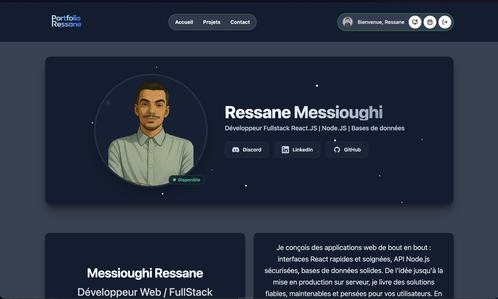
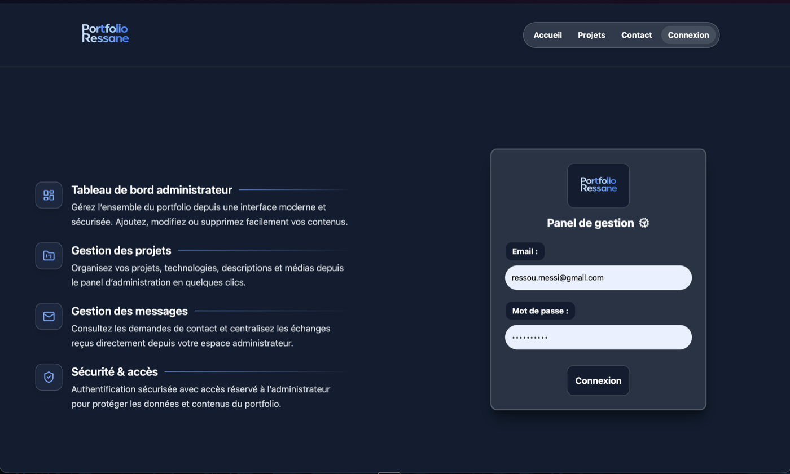
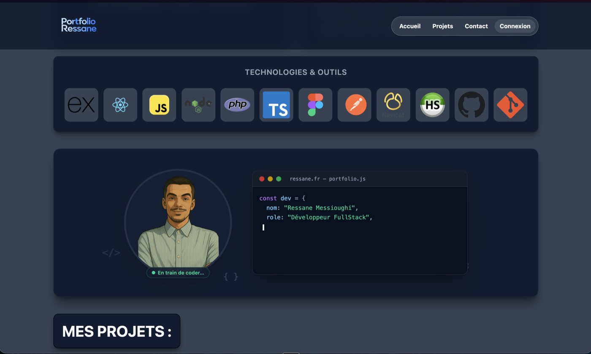
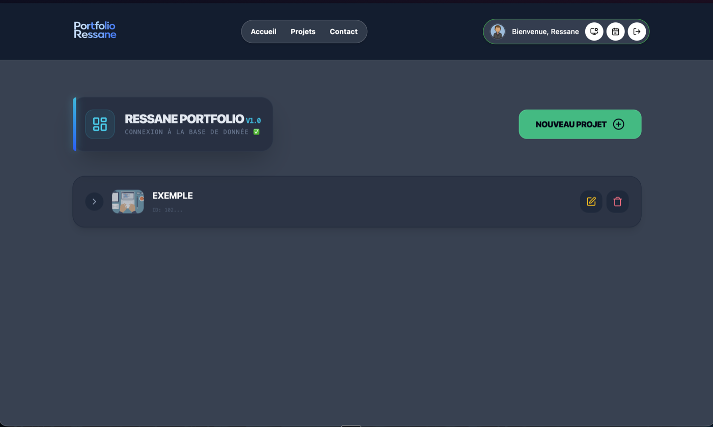
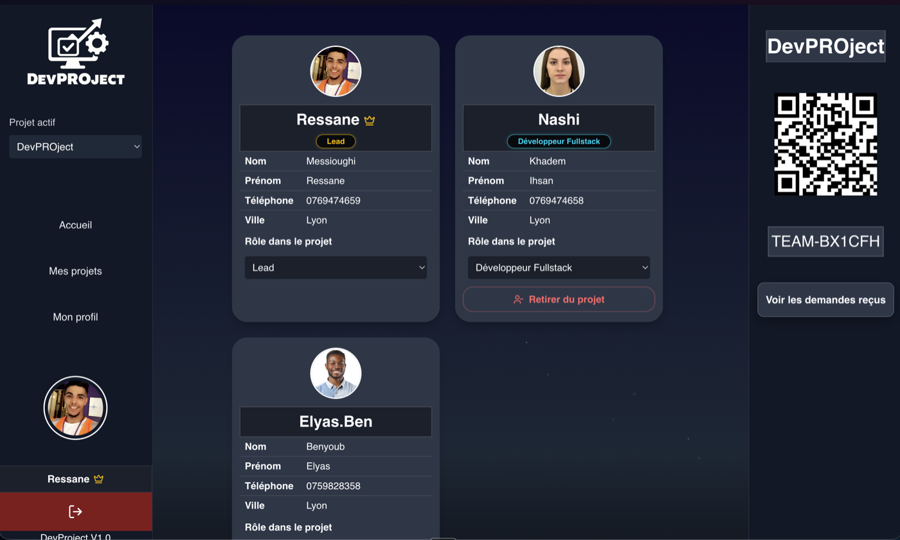
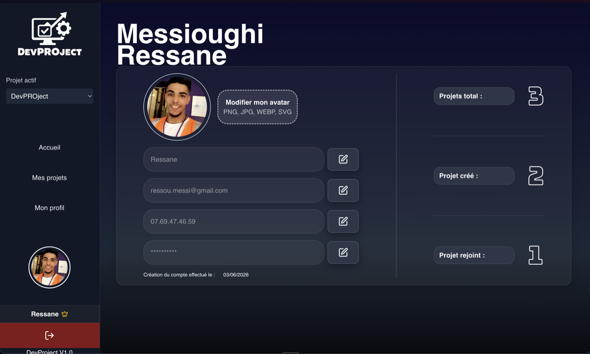
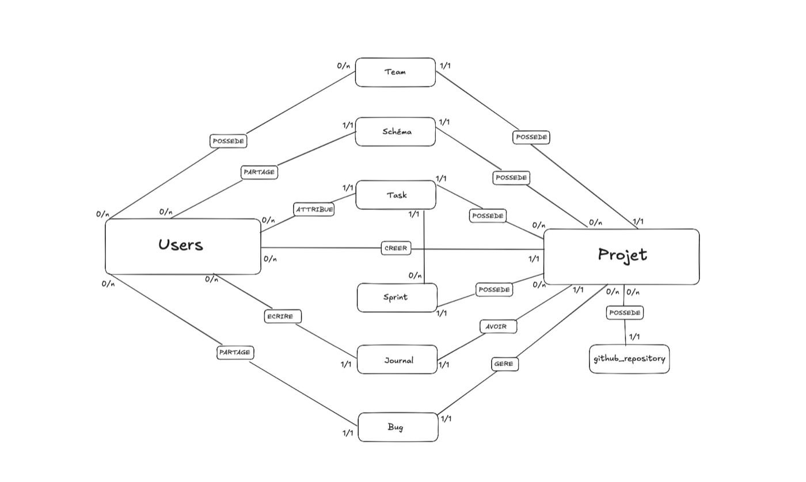
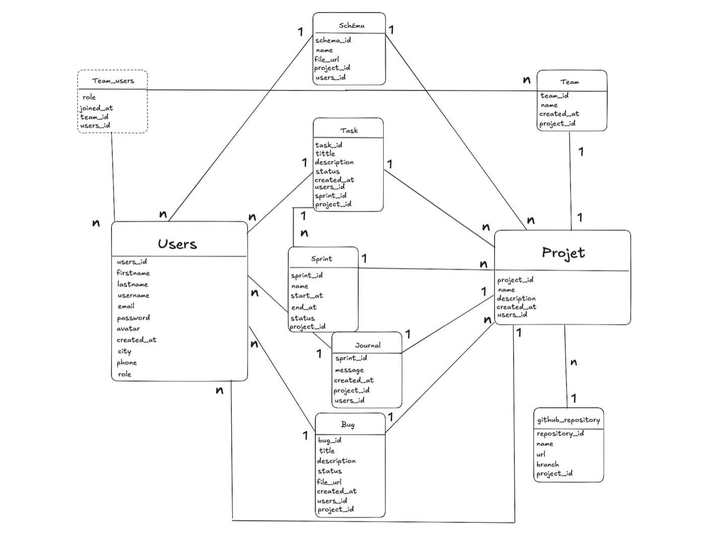
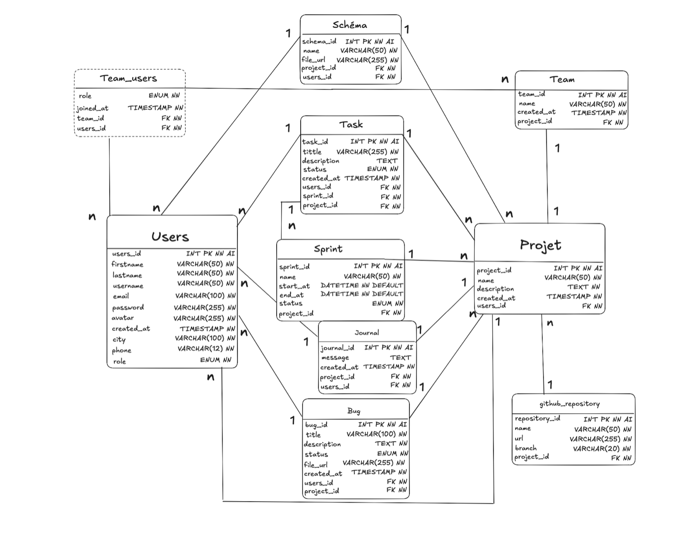

<div align="center">


# DevProject

**Le suivi de projet d'une petite équipe, au même endroit.**

[](https://react.dev)
[](https://vite.dev)
[](https://tailwindcss.com)
[](https://socket.io)

<a href="#installation">Installation</a> ·
<a href="#le-temps-réel-la-partie-qui-ma-le-plus-appris">Le temps réel</a> ·
<a href="#ce-que-je-nai-pas-fait">Limites</a> ·
<a href="https://github.com/ressane-messioughi/DevPROject-Backend">Backend</a>

</div>

---

## Pourquoi ce projet

À chaque projet de groupe pendant ma formation, la même chose se reproduisait. Les décisions se prenaient sur Discord, les bugs finissaient dans un fichier texte que personne ne rouvrait, et au bout de deux semaines plus personne ne savait qui avait fait quoi. On perdait moins de temps à coder qu'à se retrouver.

DevProject est ma réponse à ça. Une équipe, un projet, et tout ce qui le concerne au même endroit : le journal des décisions, les bugs, les membres et leurs rôles. Avec une contrainte que je me suis fixée dès le départ — **si quelqu'un publie quelque chose, les autres doivent le voir immédiatement**, sans recharger la page. C'est ce qui m'a poussé vers les WebSockets, et c'est de loin la partie qui m'a le plus appris.

C'est aussi mon projet de fin de formation pour le titre professionnel **Développeur Web et Web Mobile**.

---

## À quoi ça ressemble

|  |  |
|:--:|:--:|
|  |  |
| **Accueil** | **Connexion** |
|  |  |
| **Tableau de bord** | **Mes projets** |
|  |  |
| **Équipe** | **Profil** |

---

## Ce que ça fait

On crée un projet, ou on rejoint celui de quelqu'un d'autre avec un code d'équipe ou un lien d'invitation. Le propriétaire valide les demandes et distribue les rôles — développeur front, back, designer, et ainsi de suite. Ce rôle-là n'a rien à voir avec le rôle applicatif : c'est un rôle *dans le projet*, et c'est lui qui décide de ce qu'on peut faire.

Ensuite, chaque projet a son journal de bord pour tracer les décisions, et son suivi de bugs avec pièce jointe et changement de statut. Les membres connectés apparaissent en direct, et toute publication déclenche une notification chez les autres dans la seconde.

L'authentification passe par un JWT, les mots de passe sont hachés côté serveur avec bcrypt, et les photos de profil sont hébergées sur Cloudinary.

---

## La stack, et pourquoi

**React 19** avec les hooks, sans bibliothèque d'état externe : deux contextes suffisent largement à l'échelle du projet, et Redux aurait été de la complexité gratuite.

**Vite 8** parce que le rechargement est instantané et que le build tient en moins d'une seconde.

**Tailwind CSS 4**, et là c'est un choix assumé : j'ai supprimé toutes mes classes CSS personnalisées pour ne garder que du Tailwind. Ça se répète parfois dans le JSX, mais je n'ai plus jamais à me demander où une règle est définie ni si je casse autre chose en la modifiant.

**React Hook Form** pour la validation, qui limite les rendus inutiles, **React Router 7** pour les routes imbriquées et la protection par rôle, **Socket.IO** pour le temps réel, et **Framer Motion** pour les transitions entre pages.

Côté qualité, **ESLint et Prettier** sont enchaînés par **Husky** et **lint-staged** : impossible de commiter du code non formaté, la vérification se lance toute seule.

---

## Comment c'est organisé

```
src/
├── components/
│   ├── ui/        Design system. Aucun composant ici ne connaît le métier.
│   ├── auth/      Connexion, inscription
│   ├── layout/    Tableau de bord et navigation
│   ├── landing/   Page d'accueil publique
│   └── app/       Un dossier par domaine
│       └── bug · home · journal · profile · project · team
├── pages/         Les écrans, un par route
├── context/       AuthProvider, ProjectProvider
├── hooks/         useFetch, usePageTitle, useIsOwner, PrivateRoute
├── constants/     Valeurs partagées
├── utils/         Fonctions utilitaires
└── socket.js      L'instance Socket.IO, une seule pour toute l'app
```

La règle que je me suis donnée : un composant de `ui/` reçoit tout par props et ne sait rien du projet. S'il faut y importer un contexte, c'est qu'il n'a rien à faire là.

---

## Installation

Il vous faut **Node 20 ou plus**, le [backend](https://github.com/ressane-messioughi/DevPROject-Backend) démarré, et une base **MySQL** accessible.

```bash
git clone https://github.com/ressane-messioughi/devproject.git
cd devproject
npm install
cp .env.example .env
```

Remplissez ensuite les trois variables :

| Variable | À quoi ça sert | Exemple |
|---|---|---|
| `VITE_API_URL` | L'API du backend | `http://localhost:3000/api` |
| `VITE_SOCKET_URL` | Le serveur Socket.IO | `http://localhost:3000` |
| `VITE_APP_URL` | Le front, pour les liens d'invitation | `http://localhost:5173` |

Le préfixe `VITE_` n'est pas décoratif : sans lui, Vite n'expose pas la variable au navigateur et vous récupérerez `undefined` au moment où vous en aurez besoin.

```bash
npm run dev
```

<details>
<summary><b>Les autres commandes</b></summary>

<br>

| Commande | Effet |
|---|---|
| `npm run dev` | Serveur de développement, rechargement à chaud |
| `npm run build` | Build de production dans `dist/` |
| `npm run preview` | Sert le build de production en local |
| `npm run lint` | Analyse ESLint |
| `npm run lint:fix` | ESLint avec correction automatique |
| `npm run format` | Prettier sur tout le projet |

</details>

---

## Le temps réel, la partie qui m'a le plus appris

L'idée de départ paraissait simple : quand quelqu'un publie, les autres voient. En pratique, c'est là que j'ai passé le plus de temps, et surtout que j'ai trouvé mes deux vrais bugs.

**Une seule connexion pour toute l'application.** `socket.js` crée l'instance dans un module ES. Comme un module n'est évalué qu'une fois, tous les composants qui l'importent partagent la même connexion. J'ai vu des projets ouvrir un socket par composant — c'est une fuite garantie.

**Deux espaces par utilisateur.** Chacun rejoint une salle personnelle à son identifiant, et la salle du projet qu'il a sélectionné. La salle personnelle m'a semblé superflue au début, jusqu'à ce que je bute sur un cas concret : quand le propriétaire accepte une demande d'adhésion, le demandeur n'est encore dans aucune salle de projet. Sans casier personnel, impossible de le prévenir.

**Deux façons de diffuser, à ne pas confondre :**

```js
socket.to(room).emit(…)   // tout le monde sauf moi
io.to(room).emit(…)       // tout le monde, moi compris
```

La première annonce une arrivée — je n'ai pas besoin d'apprendre que je viens d'arriver. La seconde rediffuse la liste des membres connectés, que tout le monde doit recevoir à jour, moi le premier.

### Les deux bugs

Le premier était visible : en changeant de projet, je restais affiché « en ligne » dans le précédent. Le socket rejoignait bien la nouvelle salle, mais ne quittait jamais l'ancienne. Deux lignes à ajouter, une fois la cause comprise.

Le second m'a coûté bien plus cher, parce qu'il ne produisait **aucune erreur**. Les notifications s'arrêtaient, c'est tout. Un rechargement et ça repartait. J'ai fini par cartographier tous les `emit` et tous les `on` du projet, et la cause est apparue : après une coupure réseau ou une mise en veille, Socket.IO rétablit le transport automatiquement, mais ne rejoint aucune salle. Le socket était connecté, et sourd.

Le correctif écoute l'événement `connect` et rejoue l'entrée dans les salles à chaque reconnexion. Ce qui m'a marqué, c'est qu'une cause unique expliquait trois symptômes que je croyais sans rapport.

---

## Ce que j'ai retenu

**`fetch` ne lève pas d'exception sur une erreur HTTP.** Un 400 ou un 500 est une réponse reçue normalement : un `try/catch` seul ne les voit pas passer. Il faut tester `response.ok` pour l'erreur métier et garder le `try/catch` pour la panne réseau. Les deux ne traitent pas le même problème.

**Sur macOS, un renommage de casse peut passer inaperçu.** Le système ne distingue pas `Button.jsx` de `button.jsx`, Git et Linux si. Un `mv` sur un fichier suivi ne change rien en local puis casse le déploiement. Depuis, j'utilise `git mv` et je vérifie avec `git status`.

**Une fonction recréée à chaque rendu ne doit pas partir dans un tableau de dépendances** sans être stabilisée, sinon c'est la boucle infinie. La solution est `useCallback` au niveau du hook qui la fournit — pas un `eslint-disable` posé sur chaque effet, ce que j'avais commencé à faire avant de comprendre.

**Le mode responsive du navigateur ne remplace pas un vrai téléphone.** Sur iPhone, la barre d'adresse de Safari occupe le bas de l'écran et masquait mon bouton de déconnexion, parfaitement visible en simulation.

---

## La base de données

<div align="center">

| Conceptuel | Logique | Physique |
|:--:|:--:|:--:|
|  |  |  |

</div>

Modélisation Merise, sans ORM côté backend : les requêtes SQL sont écrites à la main avec `mysql2`. C'était volontaire — je voulais comprendre mes jointures avant de laisser une bibliothèque les écrire à ma place.

---

## Ce que je n'ai pas fait

Autant le dire moi-même plutôt que d'attendre qu'on le trouve.

**Les routes de lecture ne revérifient pas l'appartenance à l'équipe.** Seules les actions réservées au propriétaire sont contrôlées côté serveur. Un membre retiré d'un projet ne verra plus rien dans l'interface, mais l'API répondrait encore à une requête directe.

**La connexion temps réel n'est pas authentifiée.** Aucun jeton n'est transmis à l'ouverture du socket, et l'entrée dans une salle n'est pas contrôlée. C'est la même faille que ci-dessus, vue depuis le temps réel.

**La liste des membres connectés vit en mémoire.** Un redémarrage du serveur l'efface, et une mise à l'échelle sur plusieurs instances demanderait un stockage partagé.

**Il n'y a pas de tests automatisés.** La qualité repose aujourd'hui sur ESLint, Prettier, Husky et un jeu d'essai manuel documenté. Une base Vitest est la prochaine étape, et c'est le chantier que je regrette le plus de ne pas avoir ouvert plus tôt.

---

<div align="center">
<br>
<sub>Ressane Messioughi — projet de fin de formation, titre professionnel DWWM</sub>
</div>
